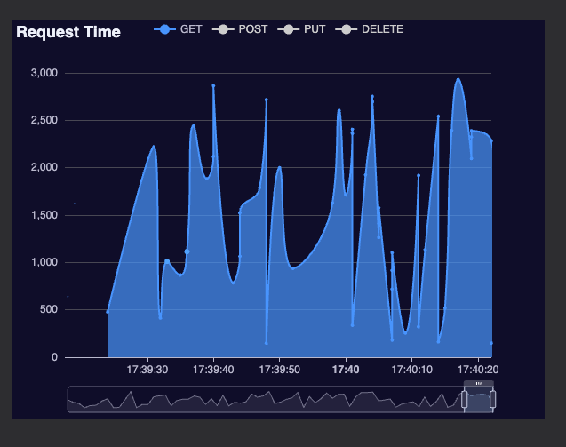

# Real time logging

A real time logging case with kafka and golang.

## Screenshot

## How to run

- Clone the repo
  - `git clone https://github.com/umtdemr/go-kafka-with-rest-case.git`
- Run docker compose
  - `docker-compose up --build`

Then open [localhost:8080](http://localhost:8080) in your browser. 
To test the real time logging, you can send a request to
[localhost:8080/api/get](http://localhost:8080/api/get).

If you want to send concurrent random requests to the app automatically, you can use [this gist](https://gist.github.com/umtdemr/b7e106d81a4fe6d9adcd367f4982edfa).

## Endpoints

| URL                                                           | Method | Description         |
|---------------------------------------------------------------|--------|---------------------|
| [localhost:8080](http://localhost:8080)                       | GET    | dashboard           |
| [localhost:8080/api/get](http://localhost:8080/api/get)       | GET    | CRUD get request    |
| [localhost:8080/api/post](http://localhost:8080/api/post)     | POST   | CRUD post request   |
| [localhost:8080/api/put](http://localhost:8080/api/put)       | PUT    | CRUD put request    |
| [localhost:8080/api/delete](http://localhost:8080/api/delete) | DELETE | CRUD delete request |

## Tech stack

- Go
- Postgresql
- Kafka
- Zookeeper (as a broker for kafka)
- Docker

## Case

A REST API should be developed using a language of your choice (preferably Java / Go / PHP / Python) to handle GET, POST, PUT, and DELETE requests with four different endpoints. The POST and PUT methods should accept requests with an empty request body.

For each request received by this API, a successful response should be returned randomly between 0-3 seconds, and just before the response is returned, a log entry should be written to a log file with the content "{method type},{request processing time in ms},{timestamp}". Example log: "GET,1000,1614679220".

An asynchronous job should take the lines written to the log file in real-time and send them to Kafka in a specified format.

A consumer should catch the log information sent to Kafka and write it to a suitable database (such as RDBMS or NoSQL).

A dashboard screen should graphically show how long the API requests in the last hour took to complete, and the graph should be updated live.

Different request types (like PUT, DELETE) should be color-coded accordingly.
